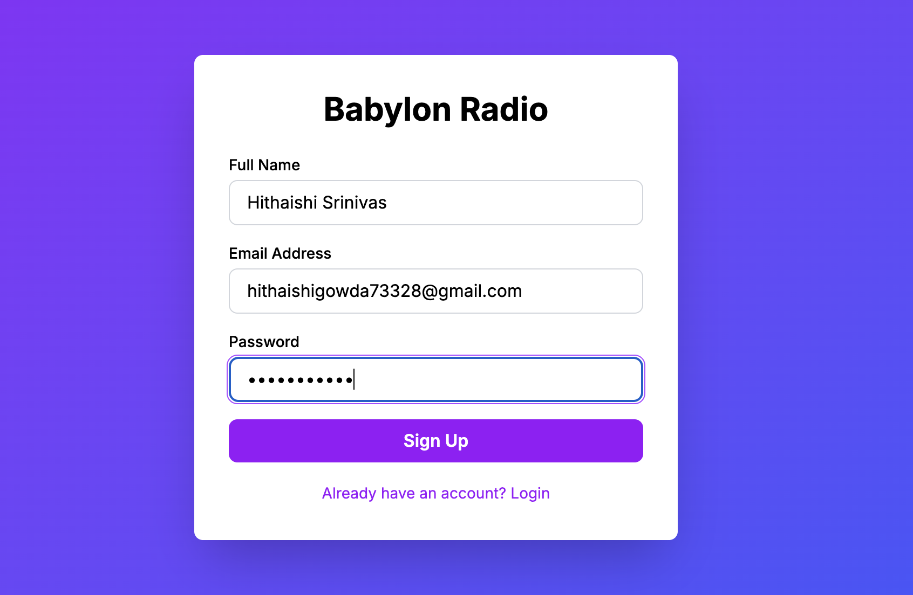
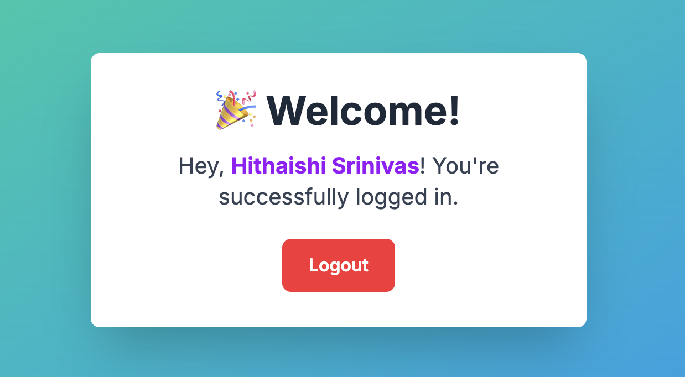

# Babylon Radio Authentication App

## Overview
A Next.js application with Firebase authentication featuring user registration, login, and protected routes.

## Architecture Decisions:

1. **Firebase Authentication:** Chose Firebase for its robust, production-ready authentication system that handles security, password hashing, and session management automatically.
2. **React Context API:** Created an AuthContext to provide authentication state and methods (signup, login, logout) to all components without prop drilling.
3. **Next.js App Router:** Utilized the modern App Router with client-side components for authentication flows and protected routes.
4. **Single Form Pattern:** Designed one form that toggles between signup/login modes to reduce code duplication and improve user experience.
5. **Client-Side Protection:** Implemented route protection using useEffect hooks that redirect unauthorized users back to the login page.

## Features
1. **User Registration with Full Name:** New users can create an account by providing their full name, email address, and password. The full name is stored using Firebase's updateProfile() method and displayed on the home page.
2. **Email/Password Authentication:** Secure authentication system provided by Firebase, handling both user registration and login flows with proper password encryption and session management.
3. **Protected Home Page:** The home page is accessible only to authenticated users, with automatic redirection to the login page for unauthorized visitors.
4. **Logout Functionality:** Users can securely sign out with a single click, clearing the authentication session and returning to the login page.
5. **Seamless Login/Signup Toggle:** A single form that switches between registration and login modes, improving user experience and reducing code duplication.

## Setup Instructions
1. Clone the repository from GitHub to your local machine using ` git clone <repository-url>`
2. Navigate to the project directory and ` run npm install` to install all required dependencies
3. Create a Firebase project, enable Email/Password authentication, and add your Firebase configuration to src/lib/firebase.js
4. Change directory to the project root: `cd babylon-radio-app` and run `npm run dev` to start the development server
5. Open your browser and navigate to ` http://localhost:3000 ` where the login page will be displayed
6. Test the application by creating a new account, verify login functionality, access the home page, and test logout.

## Challenges Faced
1. **Managing Authentication State Across Pages:** Implementing a global authentication context using React Context API with Firebase's onAuthStateChanged listener to maintain synchronized state throughout the application.
2. **Handling Both New and Returning Users in One Form:** Designing a toggle mechanism that conditionally renders the full name field and adjusts validation rules based on signup or login mode.
3. **Protecting Routes from Unauthorized Access:** Implementing client-side route protection using useEffect to check authentication status and redirect unauthorized users before content renders.
4. **Storing User's Display Name:** Firebase Authentication doesn't natively store custom fields, so I used updateProfile() immediately after registration to store the display name.
5. **Managing Asynchronous Operations:** Handling loading states during Firebase operations while preventing multiple submissions and providing appropriate user feedback.

## Future Improvements
1. **Password Reset Functionality:** Implement a "Forgot Password" feature using Firebase's sendPasswordResetEmail() method with a dedicated reset password page for secure account recovery.
2. **Email Verification:** Add email verification to confirm user accounts before granting full access, preventing spam accounts and ensuring valid email addresses.
3. **User Profile Editing:** Create a profile management page where users can update their display name, change passwords, upload profile pictures to Firebase Storage, and manage account settings.
4. **Enhanced Form Validation:** Implement robust regex-based validation for email format and password strength requirements, with real-time visual feedback as users type.
5. **Social Authentication:** Integrate OAuth providers like Google, Facebook, and Apple sign-in for convenient one-click authentication, reducing signup friction while maintaining security.